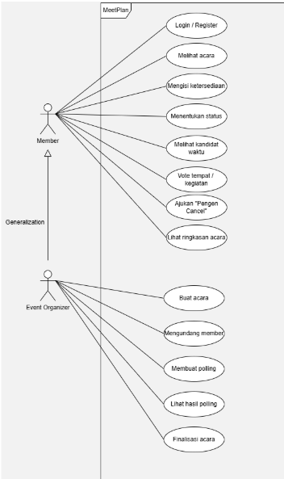
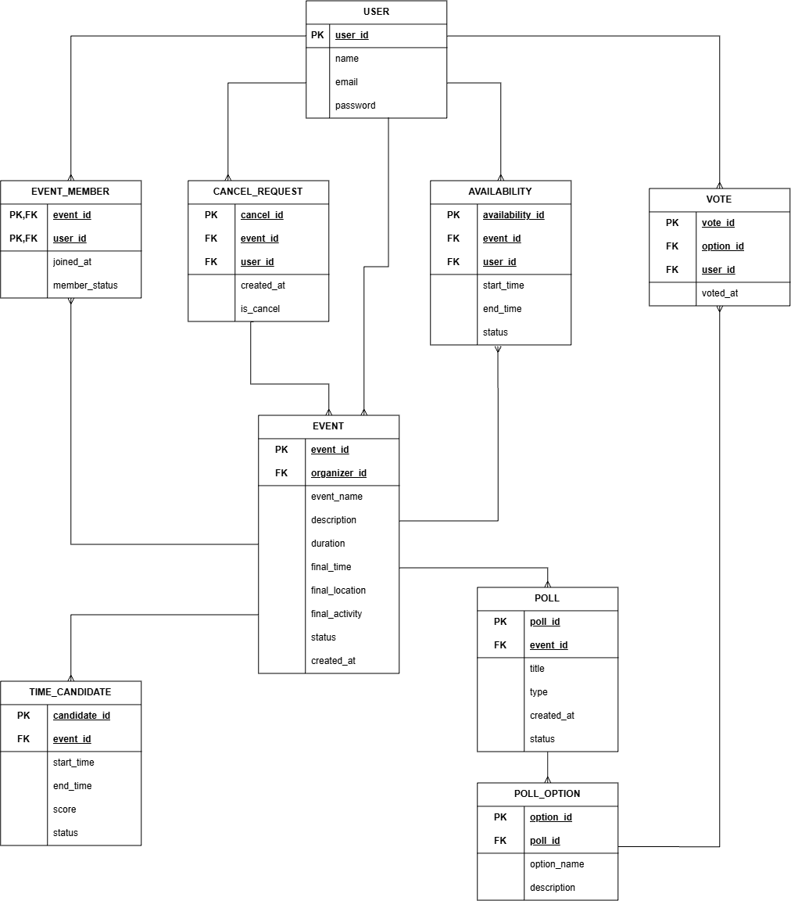
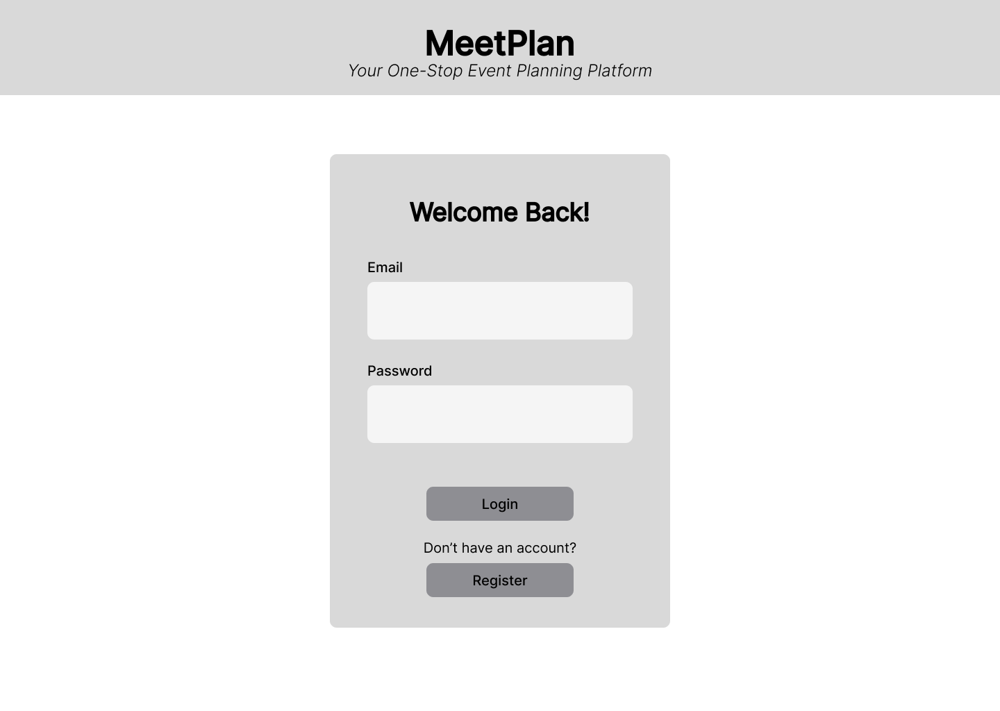
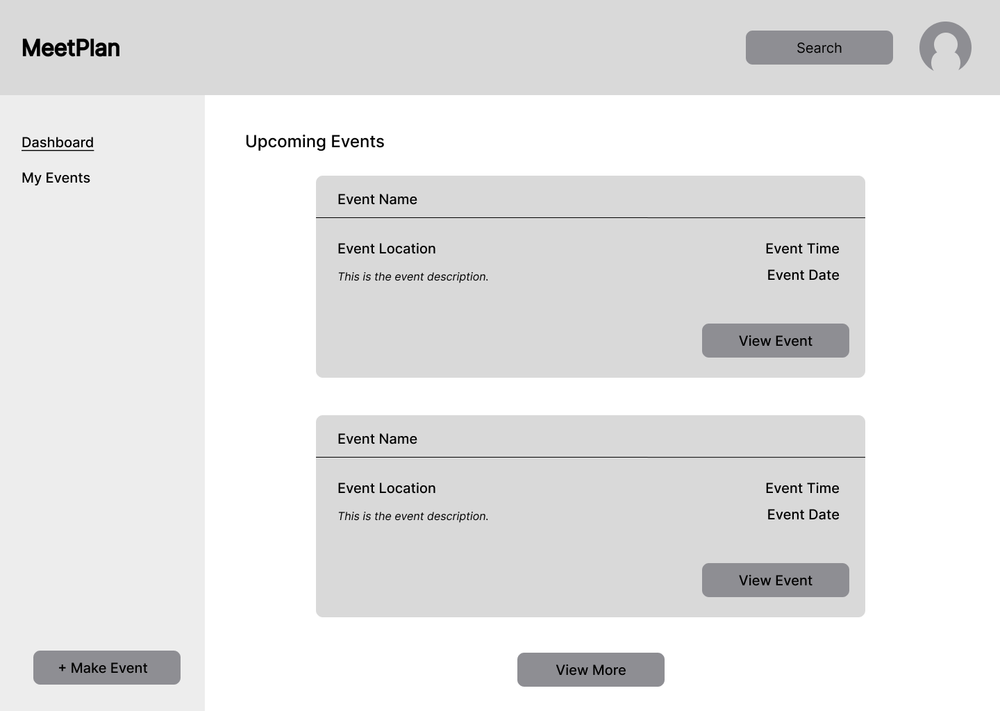
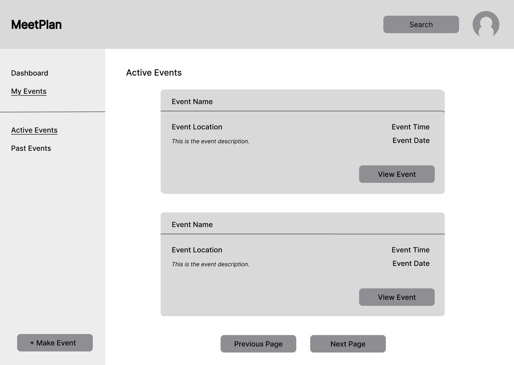
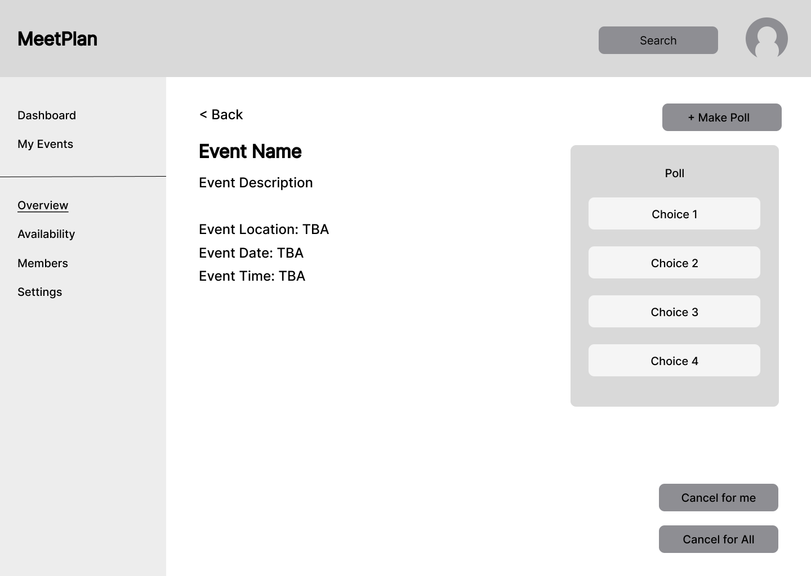
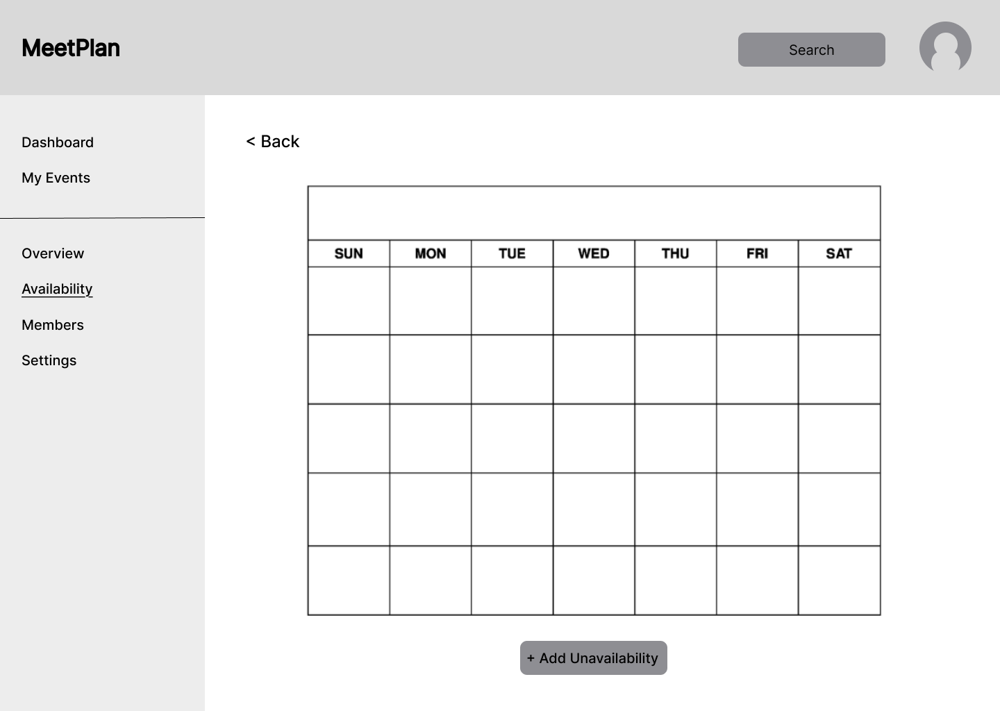
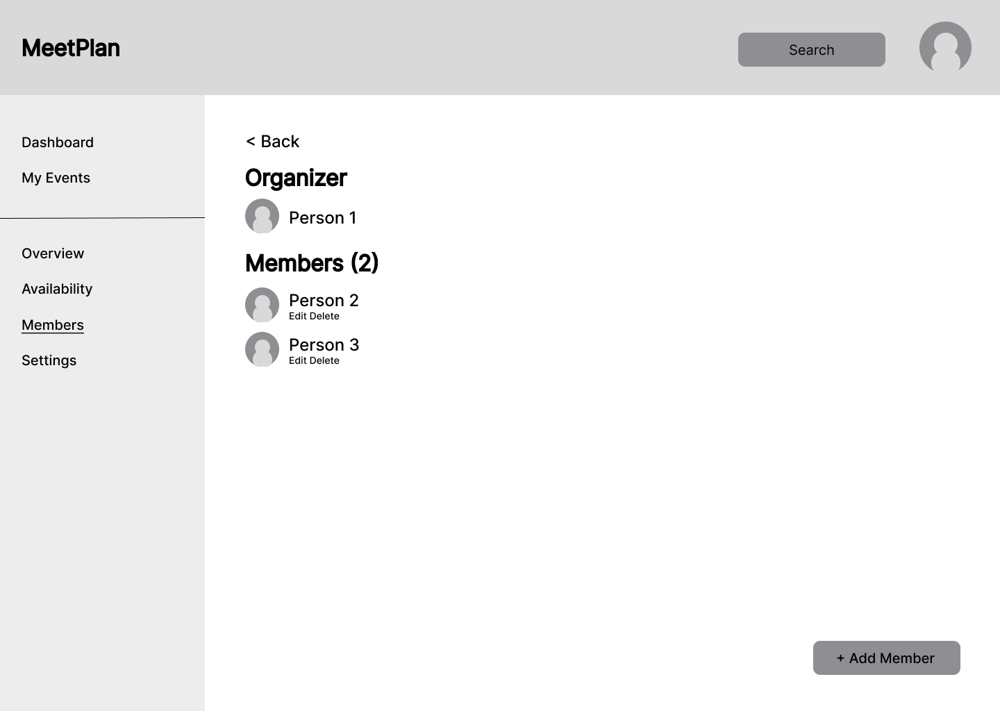
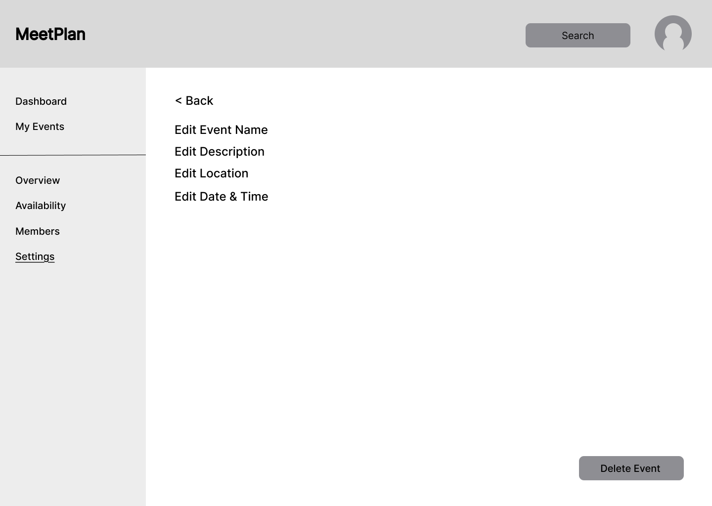

# MeetPlan

## Project Senior Project TI

**Kelompok 25**

**Departemen Teknologi Elektro dan Teknologi Informasi**  
**Fakultas Teknik**  
**Universitas Gadjah Mada**

---

## Anggota Kelompok

| No. | Nama | NIM |
|:---:|---|---|
| 1 | Muhammad Bintang Hidayatullah Marbun | 24/544012/TK/60468 |
| 2 | Arimbi Arum Sari | 24/541867/TK/60129 |
| 3 | Aston Hugo | 24/538303/TK/59700 |

---

# Modul 1 – Pembentukan Kelompok dan Perumusan Masalah

## 1. Nama Produk

**MeetPlan**

---

## 2. Jenis Produk

MeetPlan merupakan **aplikasi event planner untuk grup** yang dirancang untuk membantu kelompok dalam merencanakan acara bersama secara lebih terstruktur dan efisien.

Aplikasi ini mengintegrasikan proses penentuan waktu, pemilihan tempat atau kegiatan, serta pengambilan keputusan terkait keberlangsungan acara dalam satu alur.

---

# 3. Latar Belakang dan Permasalahan

Perencanaan acara bersama sering membutuhkan banyak percakapan untuk menentukan waktu yang sesuai, memilih tempat atau kegiatan, serta memastikan seluruh anggota tetap nyaman dengan keputusan akhir.

Permasalahan menjadi lebih kompleks ketika setiap anggota memiliki jadwal yang berbeda dan tidak semua anggota ingin menyampaikan ketidaknyamanannya secara terbuka.

Berdasarkan permasalahan tersebut, dikembangkan **MeetPlan**, yaitu aplikasi event planner yang menggabungkan pencarian waktu berdasarkan ketersediaan anggota, polling pilihan acara atau tempat, serta mekanisme anonim untuk menyampaikan keinginan membatalkan acara tanpa mengungkapkan identitas anggota yang mengajukannya.

### Rumusan Permasalahan

1. Bagaimana menemukan waktu acara yang paling sesuai dengan ketersediaan seluruh anggota secara otomatis?
2. Bagaimana membedakan jadwal yang benar-benar tidak dapat diganggu dengan jadwal yang masih bersifat tentatif?
3. Bagaimana membantu kelompok memilih tempat atau kegiatan secara adil melalui mekanisme polling?
4. Bagaimana menyediakan mekanisme anonim bagi anggota untuk menyampaikan keinginan membatalkan acara tanpa membocorkan identitas mereka kepada anggota lain?
5. Bagaimana menentukan apakah suatu acara tetap berjalan atau dibatalkan berdasarkan hasil keinginan cancel dari seluruh anggota?

---

# 4. Ide Solusi

MeetPlan dirancang sebagai aplikasi event planner untuk grup yang mengintegrasikan proses:

**Penentuan waktu → Pemilihan tempat/kegiatan → Keputusan keberlangsungan acara**

Setiap anggota dapat memasukkan waktu tidak luang ke dalam kalender dan memberikan tingkat kepastian terhadap jadwal tersebut, yaitu **"Tidak Bisa Di-cancel"** atau **"Tentatif"**.

Sistem kemudian menggunakan informasi tersebut untuk mencari kandidat waktu yang paling memungkinkan bagi seluruh anggota. Setelah waktu ditentukan, anggota dapat melakukan polling terhadap pilihan tempat atau kegiatan.

Selain itu, MeetPlan menyediakan fitur **"Pengen Cancel"** yang memungkinkan anggota menyampaikan keinginan untuk membatalkan acara secara anonim. Acara hanya akan dibatalkan apabila seluruh anggota memilih untuk cancel. Apabila terdapat setidaknya satu anggota yang tidak memilih cancel, acara tetap berjalan.

Dengan demikian, MeetPlan bertujuan mengubah proses perencanaan acara yang sebelumnya membutuhkan banyak percakapan menjadi sebuah alur yang terintegrasi dan terstruktur.

---

# 5. Rancangan Fitur

## 5.1 Kalender Ketersediaan

Anggota dapat memasukkan waktu tidak luang ke dalam kalender. Sistem akan mengelompokkan informasi ketersediaan berdasarkan hari dan jam.

## 5.2 Status "Tidak Bisa Di-cancel"

Anggota dapat menandai jadwal yang benar-benar tidak dapat diganggu. Status ini digunakan sebagai **hard constraint** dalam proses pencarian waktu acara.

## 5.3 Status "Tentatif"

Anggota dapat menandai jadwal yang masih mungkin berubah. Jadwal dengan status tentatif dapat diberikan prioritas yang lebih rendah dibandingkan jadwal dengan status "Tidak Bisa Di-cancel".

## 5.4 Pencarian Waktu Otomatis

Sistem menghasilkan kandidat waktu acara berdasarkan ketersediaan seluruh anggota dan durasi acara.

## 5.5 Polling Tempat/Kegiatan

Anggota dapat memberikan suara terhadap pilihan tempat atau aktivitas yang akan dilakukan dalam acara.

## 5.6 "Pengen Cancel" (Anonim)

Anggota dapat menyampaikan keinginan untuk membatalkan acara tanpa anggota lain mengetahui identitas pemilih.

## 5.7 Aturan Keputusan Cancel

Acara hanya dibatalkan apabila seluruh anggota memilih untuk cancel. Jika minimal satu anggota tidak memilih cancel, acara tetap berjalan.

## 5.8 Ringkasan Event

Sistem menampilkan informasi acara yang telah ditentukan dalam satu halaman, meliputi:

- Waktu final
- Lokasi atau kegiatan terpilih
- Peserta
- Status event

---

# 6. Analisis Kompetitor

Analisis kompetitor dilakukan terhadap tiga produk yang memiliki fungsi terkait dengan penjadwalan dan koordinasi kegiatan kelompok, yaitu **Google Calendar, Doodle, dan When2meet**.

---

## 6.1 Google Calendar

**Jenis Kompetitor:** Direct Competitor  
**Jenis Produk:** Calendar and Scheduling Platform

### Target Customer

Individu, tim, organisasi, dan kelompok yang telah menggunakan ekosistem Google.

### Kelebihan

- Dapat membandingkan ketersediaan kalender peserta untuk mencari waktu bertemu.
- Terintegrasi dengan event, undangan, dan ekosistem Google Calendar.

### Kekurangan

- Fokus utama Google Calendar adalah kalender dan scheduling, bukan alur khusus untuk perencanaan acara grup.
- Tidak memiliki konsep **"Pengen Cancel" anonim** dengan aturan unanimous cancel seperti yang diterapkan oleh MeetPlan.

### Key Competitive Advantage & Unique Value MeetPlan

MeetPlan menyatukan **availability berbasis prioritas, polling tempat/kegiatan, dan anonymous cancel** dalam satu alur yang berorientasi pada acara sosial.

---

## 6.2 Doodle

**Jenis Kompetitor:** Direct Competitor  
**Jenis Produk:** Group Scheduling Poll

### Target Customer

Individu dan kelompok yang membutuhkan cara untuk menemukan waktu pertemuan yang sesuai.

### Kelebihan

- Memiliki fitur **Group Poll** untuk mengusulkan beberapa waktu dan mengumpulkan pilihan peserta.
- Mendukung integrasi kalender serta pengaturan seperti deadline, reminder, dan hidden participant list pada fitur tertentu.

### Kekurangan

- Model utamanya adalah polling slot waktu, sedangkan konsep **hard constraint** dan **tentative availability** yang menjadi input kalender MeetPlan lebih eksplisit.
- Tidak memiliki fitur **"Pengen Cancel" anonim** dengan logika pembatalan hanya apabila seluruh anggota menyetujui cancel.

### Key Competitive Advantage & Unique Value MeetPlan

MeetPlan membedakan tingkat kepastian ketersediaan anggota dan menyediakan mekanisme keputusan cancel yang menjaga privasi anggota.

---

## 6.3 When2meet

**Jenis Kompetitor:** Direct Competitor  
**Jenis Produk:** Group Availability Scheduling Tool

### Target Customer

Kelompok pelajar, teman, komunitas, dan tim yang ingin menemukan waktu yang sesuai untuk bertemu.

### Kelebihan

- Memiliki sistem yang sederhana dan berfokus pada pencarian waktu yang sama-sama tersedia.
- Cocok untuk koordinasi cepat tanpa proses scheduling yang kompleks.

### Kekurangan

- Fokus pada availability dan time matching serta tidak mencakup alur lengkap untuk pemilihan tempat atau kegiatan.
- Tidak menyediakan mekanisme anonymous cancel berdasarkan keputusan seluruh anggota.

### Key Competitive Advantage & Unique Value MeetPlan

MeetPlan menawarkan pengalaman perencanaan acara secara **end-to-end**, mulai dari pencarian waktu, pemilihan aktivitas atau tempat, finalisasi acara, hingga pengelolaan keinginan cancel secara anonim.

---

# 7. Perbandingan Kompetitor

| Aspek | MeetPlan | Google Calendar | Doodle | When2meet |
|---|:---:|:---:|:---:|:---:|
| Group Scheduling | ✓ | ✓ | ✓ | ✓ |
| Availability Matching | ✓ | ✓ | ✓ | ✓ |
| Hard Constraint | ✓ | - | - | - |
| Tentative Availability | ✓ | - | - | - |
| Automatic Time Search | ✓ | ✓ | ✓ | ✓ |
| Polling Tempat/Kegiatan | ✓ | - | - | - |
| Anonymous Cancel | ✓ | - | - | - |
| Unanimous Cancel Rule | ✓ | - | - | - |
| Event Summary | ✓ | ✓ | - | - |
| End-to-End Social Event Planning | ✓ | - | - | - |

---

# 8. Keunggulan Kompetitif MeetPlan

Berdasarkan analisis kompetitor, MeetPlan memiliki keunggulan utama pada integrasi beberapa kebutuhan perencanaan acara dalam satu platform.

Keunggulan tersebut meliputi:

1. **Availability berbasis prioritas**  
   MeetPlan membedakan jadwal yang benar-benar tidak dapat diganggu dengan jadwal yang masih tentatif.

2. **Pencarian waktu otomatis**  
   Sistem membantu menghasilkan kandidat waktu berdasarkan ketersediaan seluruh anggota dan durasi acara.

3. **Polling tempat atau kegiatan**  
   Kelompok dapat menentukan tempat atau aktivitas melalui mekanisme voting.

4. **Anonymous Cancel**  
   Anggota dapat menyampaikan keinginan membatalkan acara tanpa mengungkapkan identitasnya kepada anggota lain.

5. **Unanimous Cancel**  
   Acara hanya dibatalkan apabila seluruh anggota memilih cancel.

6. **End-to-End Event Planning**  
   MeetPlan mengintegrasikan proses pencarian waktu, pemilihan tempat atau kegiatan, finalisasi, dan pengelolaan keputusan cancel dalam satu alur.

Dengan kombinasi fitur tersebut, MeetPlan berfokus pada kebutuhan **perencanaan acara sosial secara berkelompok**, bukan hanya pada pencarian waktu pertemuan.

---

# 9. Kesimpulan

MeetPlan merupakan aplikasi event planner untuk grup yang dirancang untuk menyederhanakan proses perencanaan acara bersama.

Permasalahan utama yang ingin diselesaikan adalah kesulitan dalam menemukan waktu yang sesuai, menentukan tempat atau kegiatan, serta menyampaikan keinginan untuk membatalkan acara secara nyaman dan anonim.

Melalui fitur kalender ketersediaan, status "Tidak Bisa Di-cancel", status "Tentatif", pencarian waktu otomatis, polling tempat atau kegiatan, serta fitur "Pengen Cancel" anonim, MeetPlan menyediakan solusi terintegrasi untuk proses perencanaan acara kelompok.

Hasil analisis kompetitor menunjukkan bahwa Google Calendar, Doodle, dan When2meet memiliki kemampuan dalam membantu penjadwalan kelompok, tetapi MeetPlan menggabungkan **availability berbasis prioritas, polling tempat/kegiatan, dan anonymous cancel** dalam satu alur yang berorientasi pada acara sosial.

---

## Daftar Pustaka

1. Google Calendar Help. (2026). *Find times to meet in Google Calendar*.
2. Doodle Help Center. (2026). *Group Poll: Scheduling Meetings with a Group*.

---

# Modul 2 — SDLC

## 1. Metodologi Pengembangan

Metodologi yang digunakan dalam pengembangan MeetPlan adalah **Agile**.

Agile dipilih karena kebutuhan aplikasi dapat berubah berdasarkan hasil diskusi, evaluasi, dan masukan dari anggota kelompok. Pengembangan dilakukan secara iteratif melalui beberapa sprint sehingga setiap bagian sistem dapat dikembangkan, diuji, dan dievaluasi secara berkala.

Pendekatan ini juga memungkinkan kelompok untuk memperoleh hasil pengembangan secara bertahap dan melakukan perbaikan sebelum keseluruhan sistem selesai.

---

# 2. Product Goal

Tujuan utama MeetPlan adalah:

> **Membangun aplikasi perencanaan acara kelompok yang membantu pengguna menentukan waktu, tempat, dan kegiatan secara efisien dengan mempertimbangkan ketersediaan dan preferensi seluruh anggota.**

Secara lebih spesifik, MeetPlan bertujuan untuk:

1. Mengurangi komunikasi yang tidak efisien dalam menentukan waktu acara.
2. Membantu kelompok menemukan waktu yang sesuai berdasarkan ketersediaan anggota.
3. Memfasilitasi pemilihan tempat dan kegiatan melalui polling.
4. Memberikan ruang bagi anggota untuk menyampaikan keinginan membatalkan acara secara anonim.
5. Menyediakan informasi acara yang telah disepakati dalam bentuk ringkasan.

---

# 3. Potential Users dan Kebutuhan

| Potential User | Kebutuhan |
|---|---|
| Event Organizer | Membuat acara dan mengatur proses perencanaan |
| Event Organizer | Mengundang anggota ke dalam acara |
| Event Organizer | Membuat polling tempat atau kegiatan |
| Event Organizer | Melihat hasil polling |
| Event Organizer | Melakukan finalisasi acara |
| Member | Melihat acara yang diikuti |
| Member | Mengisi ketersediaan |
| Member | Menentukan status ketersediaan |
| Member | Melihat kandidat waktu |
| Member | Memberikan suara pada polling |
| Member | Mengajukan "Pengen Cancel" secara anonim |
| Member | Melihat ringkasan acara |

---

# 4. Use Case Diagram

Use Case Diagram MeetPlan menggambarkan interaksi antara dua aktor utama, yaitu **Member** dan **Event Organizer**.

### Aktor

**Member**

Member dapat:

- Login / Register.
- Melihat acara.
- Mengisi ketersediaan.
- Menentukan status ketersediaan.
- Melihat kandidat waktu.
- Vote tempat atau kegiatan.
- Mengajukan "Pengen Cancel".
- Melihat ringkasan acara.

**Event Organizer**

Event Organizer merupakan turunan dari Member dan memiliki seluruh kemampuan Member, ditambah kemampuan:

- Membuat acara.
- Mengundang member.
- Membuat polling.
- Melihat hasil polling.
- Melakukan finalisasi acara.

---

# 5. Functional Requirements

| ID | Functional Requirement | Deskripsi |
|---|---|---|
| FR-01 | Login | Sistem memungkinkan pengguna melakukan login. |
| FR-02 | Register | Sistem memungkinkan pengguna membuat akun. |
| FR-03 | Melihat acara | Pengguna dapat melihat daftar acara yang diikuti. |
| FR-04 | Membuat acara | Event Organizer dapat membuat acara baru. |
| FR-05 | Mengundang member | Event Organizer dapat mengundang pengguna untuk bergabung ke acara. |
| FR-06 | Mengisi ketersediaan | Member dapat memasukkan waktu ketersediaannya. |
| FR-07 | Menentukan status | Member dapat menentukan status ketersediaannya. |
| FR-08 | Menentukan kandidat waktu | Sistem dapat menghasilkan kandidat waktu berdasarkan ketersediaan. |
| FR-09 | Melihat kandidat waktu | Member dapat melihat kandidat waktu yang tersedia. |
| FR-10 | Membuat polling | Event Organizer dapat membuat polling tempat atau kegiatan. |
| FR-11 | Vote polling | Member dapat memberikan suara pada pilihan polling. |
| FR-12 | Melihat hasil polling | Event Organizer dapat melihat hasil polling. |
| FR-13 | Mengajukan "Pengen Cancel" | Member dapat mengajukan keinginan untuk membatalkan acara secara anonim. |
| FR-14 | Memproses pembatalan | Sistem dapat menentukan apakah acara perlu dibatalkan berdasarkan pilihan anggota. |
| FR-15 | Finalisasi acara | Event Organizer dapat menetapkan hasil akhir acara. |
| FR-16 | Melihat ringkasan | Member dapat melihat informasi akhir acara. |

---

# 6. Entity Relationship Diagram

ERD digunakan untuk menggambarkan struktur data dan hubungan antarentitas yang dibutuhkan oleh MeetPlan.

### Entitas Utama

- **USER** — menyimpan informasi pengguna.
- **EVENT** — menyimpan informasi acara.
- **EVENT_MEMBER** — menghubungkan user dengan event.
- **AVAILABILITY** — menyimpan ketersediaan anggota.
- **TIME_CANDIDATE** — menyimpan kandidat waktu.
- **POLL** — menyimpan informasi polling.
- **POLL_OPTION** — menyimpan pilihan pada polling.
- **VOTE** — menyimpan suara pengguna.
- **CANCEL_REQUEST** — menyimpan permintaan pembatalan acara.

### Relasi Utama

- Satu user dapat menjadi organizer dari banyak event.
- Satu event memiliki satu organizer.
- Satu user dapat mengikuti banyak event.
- Satu event dapat memiliki banyak member.
- Satu event dapat memiliki banyak data availability.
- Satu event dapat memiliki banyak kandidat waktu.
- Satu event dapat memiliki banyak polling.
- Satu polling memiliki banyak pilihan.
- Satu pilihan polling dapat menerima banyak vote.
- Satu event dapat memiliki banyak cancel request.

---

# 7. Low-Fidelity Wireframe

Low-fidelity wireframe dibuat untuk menggambarkan struktur dan alur antarmuka MeetPlan sebelum masuk ke tahap desain visual.

Wireframe mencakup beberapa halaman utama:

1. Login / Register
   
2. Dashboard
   
3. My Events
   
4. Event Overview
   
5. Event Availability
   
6. Event Members
    
7. Event Settings
    

---

## 8. Gantt Chart

Pengembangan MeetPlan menggunakan metodologi Agile yang dibagi menjadi tiga sprint. Setiap sprint mencakup proses planning, development, testing, review, dan retrospective.

**Keterangan:** ■ = kegiatan dilakukan pada pertemuan tersebut.

| Kegiatan / Sprint | P1 | P2 | P3 | P4 | P5 | P6 | P7 | P8 | P9 | P10 | P11 | P12 |
|---|:---:|:---:|:---:|:---:|:---:|:---:|:---:|:---:|:---:|:---:|:---:|:---:|
| **Sprint 1 – Foundation** | | | | | | | | | | | | |
| Sprint Planning & Requirement | ■ | | | | | | | | | | |
| Use Case & Functional Requirement | ■ | ■ | | | | | | | | | |
| ERD & System Design | | ■ | ■ | | | | | | | | |
| Low-Fidelity Wireframe | | ■ | ■ | | | | | | | | |
| Prototype / Increment 1 | | | ■ | | | | | | | | |
| Testing & Sprint Review 1 | | | | ■ | | | | | | | | |
| **Sprint 2 – Core Features** | | | | | | | | | | | | |
| Sprint Planning 2 | | | | ■ | | | | | | | |
| Database & Backend Development | | | | | ■ | ■ | | | | | |
| Availability & Time Candidate | | | | | ■ | ■ | ■ | | | | |
| Polling & Voting | | | | | | ■ | ■ | | | | |
| Integration & Testing | | | | | | | ■ | | | | |
| Sprint Review & Retrospective 2 | | | | | | | | ■ | | | |
| **Sprint 3 – Completion & Release** | | | | | | | | | | | | |
| Sprint Planning 3 | | | | | | | | ■ | | | | |
| Anonymous Cancel | | | | | | | | ■ | ■ | | | |
| Event Finalization & Summary | | | | | | | | ■ | ■ | | | |
| Frontend–Backend Integration | | | | | | | | | ■ | ■ | | |
| System Testing & Bug Fixing | | | | | | | | | | ■ | ■ | |
| Final Sprint Review & Retrospective | | | | | | | | | | | | ■ |
| Deployment & Documentation | | | | | | | | | | | | ■ |

---
